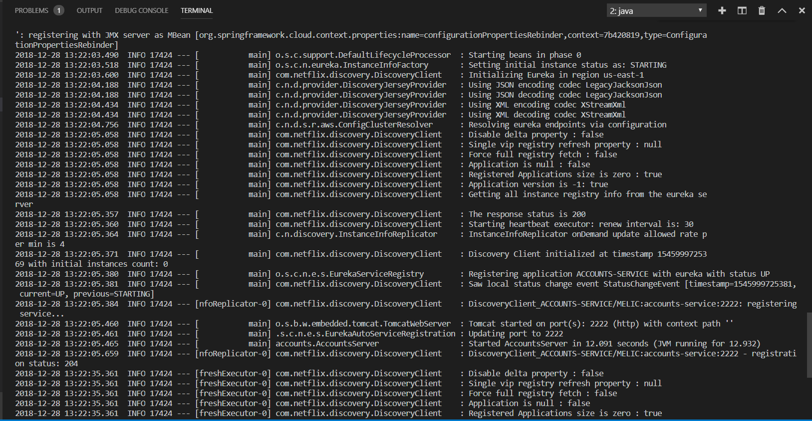

# Lab6 - Microservices - Documentation

This is a brief documentation about the topics on the wiki

**T1**: The two microservices are running and registered (two terminals, logs screenshots).

Here we can see how the Accounts Microservice is up and registred

Here we can see how the Web Microservice is up and registred

**T2**: The service registration service has the two microservices registered (a third terminal, dashboard screenshots)

Here we can see the dashboard with both the Accounts and the Web Microservices registred

**T3**: A second account microservice is running in the port 4444 and it is registered (a fourth terminal, log screenshots).

Here we can see the dashboard with three microservices registred,both the Accounts on port 2222 and the Web microservices as well as the Accounts microservice on port 4444

To make this microservice listen on port 4444, the port number must be changed on a configuration .yml file which is loaded on execution time. This file is [application.yml](accounts/src/main/resources/application.yml)

Here we can see how the Accounts Microservice is up on port 4444 and registred

**T4**: A brief report describing what happens when you kill the microservice with port 2222. Can the web service provide information about the accounts? Why?

When the microservice listening on port 2222 is killed and you try to retrieve information about the accounts, you can still get it, because, the application swaps the microservice and gets the information from the microservice listening on port 4444, which is a replica.

Here we can see the demo application and the information retrieved from the microservice on port 4444

Here we can see Logs of Accounts microservice on port 4444

